# Oracle Cloud Account and Instance Creation

Go to https://signup.cloud.oracle.com/ and choose a region of your choice. **Important Note** You cannot change the region once you choose it. If you want better speed, choose a region near by your place. If you want to access services that are available on specific country, then choose that country.

## Compute Instance Creation

### 1. Compute Engine

Click the hamburger menu on left top of the page, then choose Compute > Instances. <br>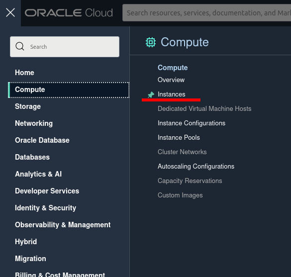

### 2. Create Instance

Choose Compartment on the left side, which you have mentioned while creating the account, then click <button>Create Instance</button> button <br>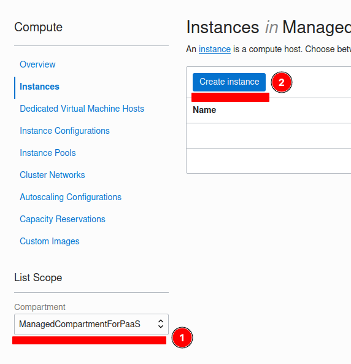

### 3. Name your Instance

Give a name for your instance and make sure the chosen compartment is right. Then click <button>Change Image</button> button <br>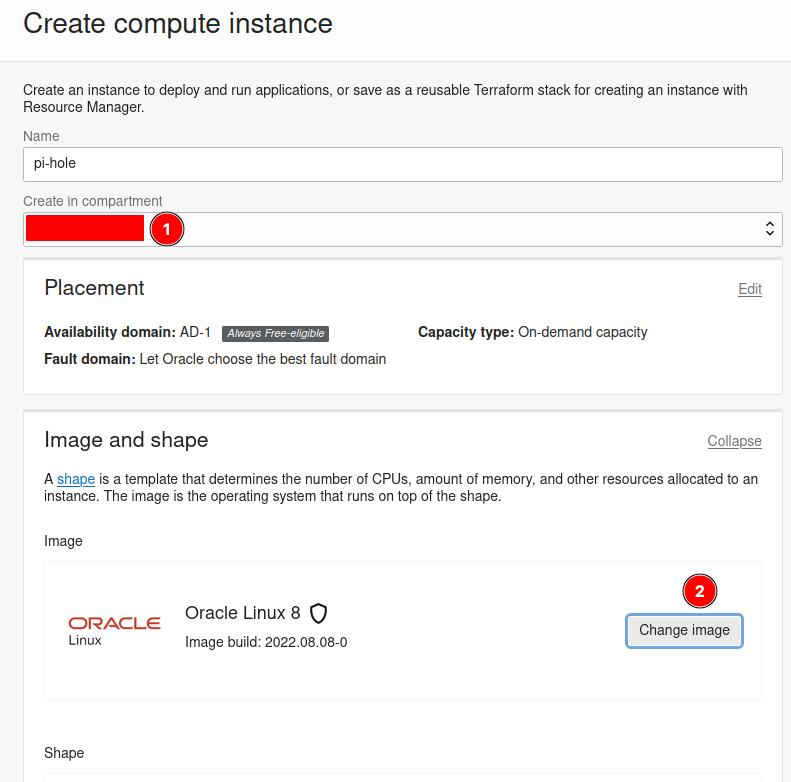

### 4. Choose Instance Image

Choose Ubuntu 22.04 instead of Oracle 8. Optional: You may choose Ubuntu 20.04 or minimal editions, the choice is yours. <br>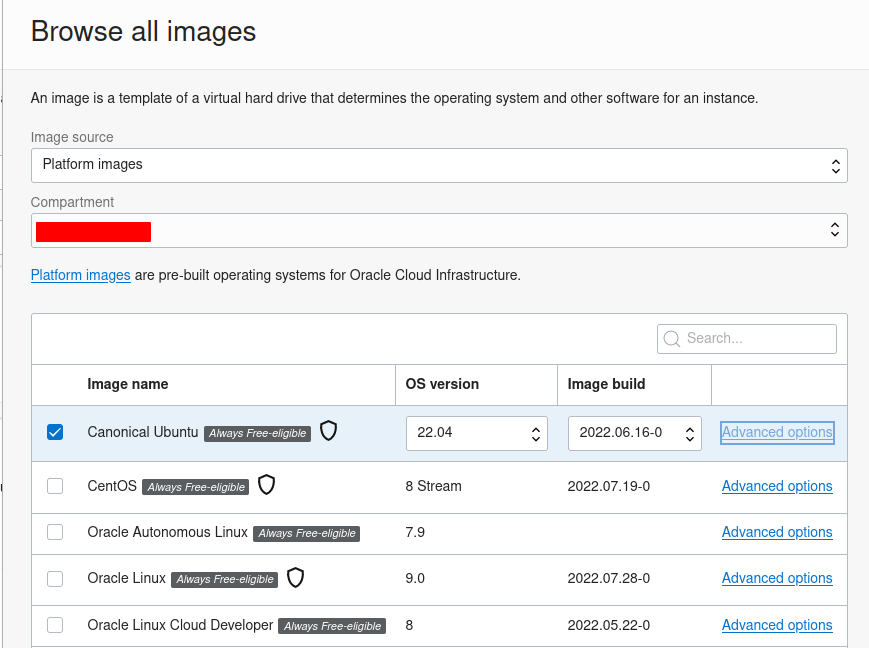

### 5. SSH Key

Choose the SSH Key option based on your choice. If you don't know what is SSH key, then choose the option mentioned in the screenshot. Make sure you download both Public Key and Private Key in a safe place. Optional: You can google it how to create SSH key using terminal and paste the public key in the given option. <br>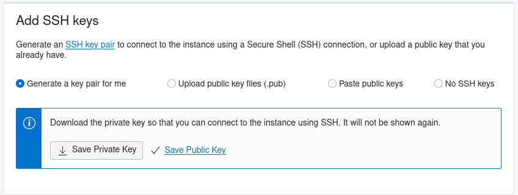

### 6. Advanced Options (this step is optional)

If you don't want Oracle running multiple tracking services to check the compute instance's performance, you can disable them. <br>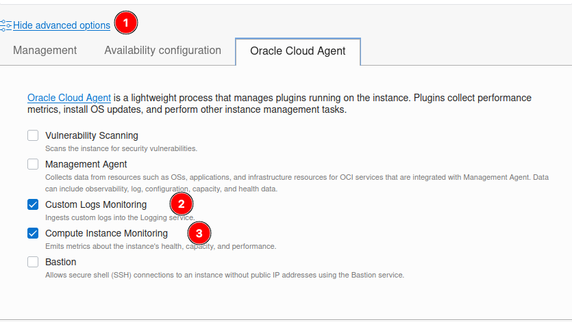

### 7. Instance Status

It will take few minutes to create and run the instance. You will see the status on left turning from orange to green. Once you see it in green, click Public 'Pubnet link' to open ports. <br>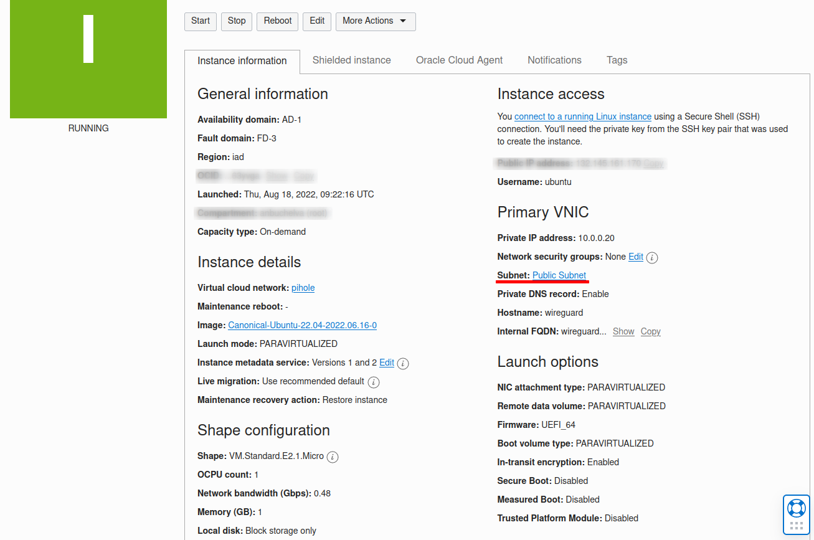

_Make a note of the public IP address in this step_

### 8. Edit Public Subnet

Click the Public Subnet link <br>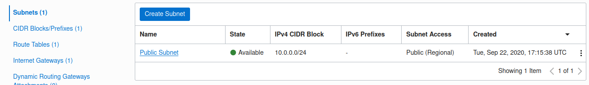

### 9. Update Security List

Click the Default Security list for your instance (the name might be different for you.) <br>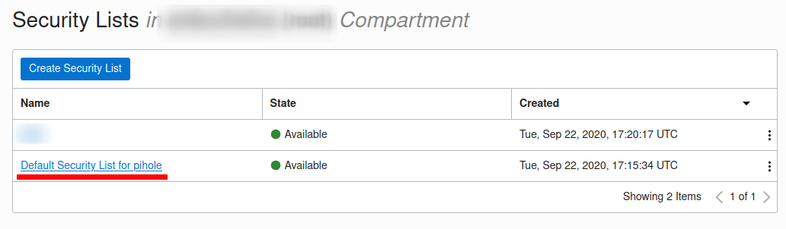

### 10. Open UDP and TCP Ports

Click New Ingress Rule and add the UDP port 51515, this will be used when setting up Wireguard and Pi-hole <br>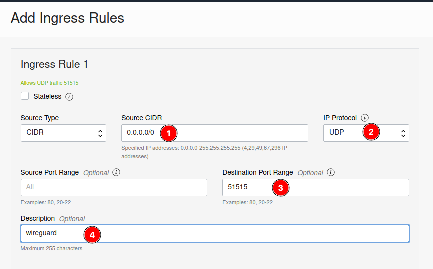

Click New Ingress Rule and add the TCP port 80, this will be used to access the Pi-hole web dashboard <br>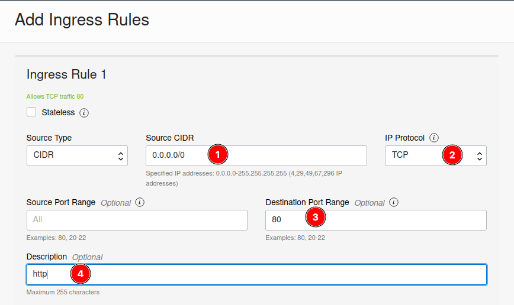

## Connect to Oracle Cloud Instance

Once you complete the above mentioned 10 steps, connect to the cloud instance from your terminal. You can use Windows Terminal (for Windows 11 users) or Power Shell (Windows 10 or Windows 11) or Putty (all windows versions) based on your need. Linux and Mac users can use the terminal that comes with the OS. Android users can use JuiceSSH client.

The following commane to be used for connecting to the instance.

```bash
ssh -i <path/to/your/private/key> -p 22 ubuntu@public.ip.of.instance
```

The real connection would look like that.

```bash
ssh -i ~/.ssh/id_rsa -p 22 ubuntu@172.173.174.175
```

**Note:** You may face connection issues, if the SSH key is open to all users. Get help from Google.

## Install Pi-hole and Wireguard

1. The pi-hole installation step will install required packages. However, before you begin try updateing the packages by running `sudo apt update && sudo apt upgrade -y`

2. If the instance asks for restart, please do.

3. Then copy the below code to install the wireguard and Pi-hole.

   ```bash
   sudo su -
   curl -O https://raw.githubusercontent.com/anbuchelva/Pi-hole-and-Wireguard-on-Oracle-Cloud-always-free-tier/master/setup.sh
   chmod +x setup.sh
   bash ./setup.sh
   ```

- `sudo su -` script would give the root privileges.
- The `curl` command would download the setup script from this repository.
- The `chmod + x` command would give the execution privilege to the setup script.
- The `bash ./setup.sh` command would execute the setup process of wireguard and pi-hole.

4. Accept the default values provided throughout the entire installation process, once it is running, the only key you need to press is `ENTER`.

   - The Pi-Hole installation will begin after the Wireguard network interface is configured. You should accept all the default options throughout the Pi-Hole installation, by pressing `ENTER`.

5. At the end, you will get a QR code you can scan to connect your mobile devices. You could optionally use the provided **.conf** files to import your Wireguard Client Profiles into your devices.

6. To add additional Wireguard VPN Clients, run **setup.sh** again. You must run this script as the root user, from within the **/root** home directory. This can be accomplished by making sure you have performed _Step 1_ before performing this step.

```bash
bash ./setup.sh
```

It will automatically increment the IP Addresses for each new client profile, continue accepting all the default values the script provides. The option to edit values is provided for advanced users with edge case requirements.

6. [Configure the Wireguard VPN Client on your device](./CONNECTING-TO-WG-VPN.md). Once your device is connected via Wireguard, all your DNS requests will flow through Pi-Hole. Your device will be identified by its IPv6 address in Pi-Hole's admin interface, which will be accessible at both `http://[fd42:42:42::1]/admin` and `http://10.66.66.1/admin`. The default configuration (which is the recommended configuration) for all VPN profiles is Split Tunnel. If you wish to route all your traffic through the VPN (Full Tunnel), edit the **Allowed IPs** on your Client Profile on your device to read `0.0.0.0/0, ::/0`.

## Change MTU Value (Optional: if you face connection issues)

You may change the MTU value from the following file
`/sys/class/net/wg0/mtu`

Steps to change:

1. `sudo nano /sys/class/net/wg0/mtu`
2. Change the value to 1420
3. `Ctrl` + `x` then `y` to save.

Sometimes the clients would take long time to connect. This will fix the issue.

## Update Host Names (Optional Step)

edit `/etc/hosts/` file to update the client names, if you wish to see the client names instead of the ip address of client devices.

`sudo nano /etc/hosts` would open the hosts file in edit mode.

Add clients like given below:

```
10.66.66.2      linux-dell-pc
fd42:42:42::2   linux-dell-pc
10.66.66.3      android-phone
fd42:42:42::3   android-phone
10.66.66.4      android-tv
fd42:42:42::4   android-tv
```

`Ctrl` + `x` then `y` to save.

## Edge Case Requirements

### Configure automated Pi-Hole updates and scheduled reboots

Pause and consider if you need this for mission critical Pi-hole Servers. If you are running multiple Pi-Holes for redundancy, and you choose to implement this, stagger the upgrade and reboot schedules. Be prepared to perform health-checks to ensure all services are operational. Blind upgrades are not gauranteed to be smooth.

**Note:** The following steps assume you have **nano** installed. You can use any other editor (e.g **vim**) to do this.

Create the script to check if a reboot is required or not, by checking for the presence of the **/var/run/reboot-required** file, by running:

```bash
sudo nano /etc/cron.daily/zz-restart-if-required
```

Paste the following into **/etc/cron.daily/zz-restart-if-required**:

> ```bash
> #!/bin/sh
> if [ -f /var/run/reboot-required ]; then
>   /sbin/shutdown -r now
> fi
> ```

Set the correct permissions:

```bash
sudo chmod 755 /etc/cron.daily/zz-restart-if-required
```

Check for Pi-Hole updates and perform an update if one is available:

Create the script to update PiHole:

```bash
sudo nano /etc/cron.daily/update-pi-hole
```

Paste the following into **/etc/cron.daily/update-pi-hole**:

> ```bash
> #!/bin/sh
> /usr/local/bin/pihole -up
> ```

Set the correct permissions:

```bash
sudo chmod 755 /etc/cron.daily/update-pi-hole
```

### Enabling or Blocking communication between Wireguard Clients

If you wish to enable communication between select Wireguard clients, using the same CIDR notation under **Allowed IPs** in each Client Configuration file is necessary. This table could help you plan which devices get what IPs.
